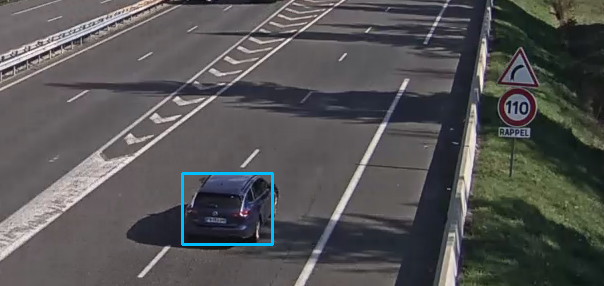

# CentralTrafficProcessing (CTP)
**Central Traffic Processing**

 

The project's goal is to process videos in order to locate elements of road traffic.
In this project, these are limited to cars, trucks, buses and motorcycles.

**Warning**: during installation you must import your own data inside the data file !

## Setup Environment

The system works with :

- *python3*

- *pip3* 

The following code will install all mandatory packages that are used inside the project. 

```
make setup
```

> pip3 -r requirements.txt

## Documentation

The following code will create html files inside the **docs** folder.
These html files gather all the documentation of the code.
```
make gen-doc
```
> pdoc --html main.py wvideo.py database_vision.py ./test/video_test.py --force --output-dir docs

## Test 

The following code provides simple tests for the system. 
Nonetheless, it should be sufficient for doing a rapid check of the global installation.

```
make project-test
```

## Run

The following command will launch the main program with the following pipeline:

- Get global setup variables from setup.json

- Process each video file

```
make run
```
